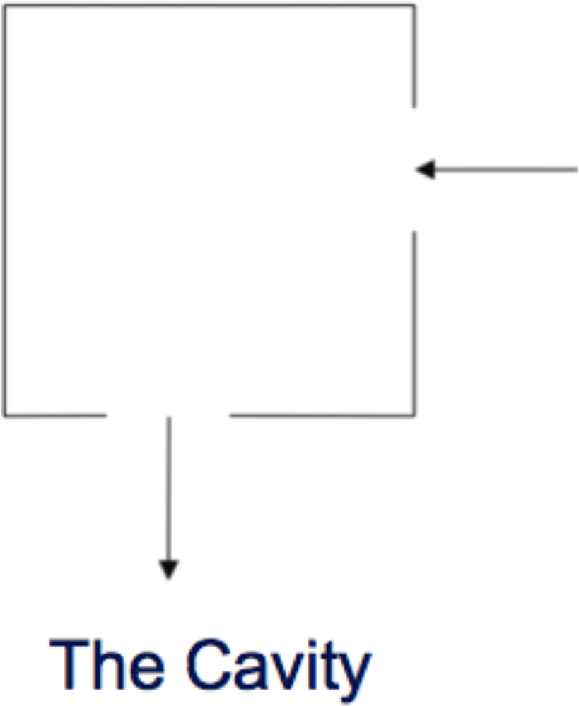

# Problem 4

You have been approached by a researcher who needs some help preparing a computational teaching exercise for an undergraduate module introducing Fluid Dynamics.

Your colleague wants to demonstrate a number of principles, including finite difference approaches and grid decomposition.

They would like a coding exercise to determine the flow pattern of a fluid in a cavity. For simplicity, the liquid is assumed to have zero viscosity which implies that there can be no vortices (i.e. no whirlpools) in the flow. The cavity is a square box with an inlet on one side and an outlet on another as shown below.

  

Describe how you would go about creating a programming exercise to solve this problem, the design decisions and assumptions that you need to let the undergraduates know about, and how you would test a solution. They may also need some pointers and reminders of the underpinning theory.

Provide a commented solution (in a language of your choice).

**Please provide both your code and your explanations in the response to this problem.**

## Solution

In the [cavity_flow](cavity_flow.ipynb) notebook you can find a simple solution for this problem. Please be aware that the algorithm in this notebook is written simply for comprehension purposes. The implemented code returns the following result:

  

