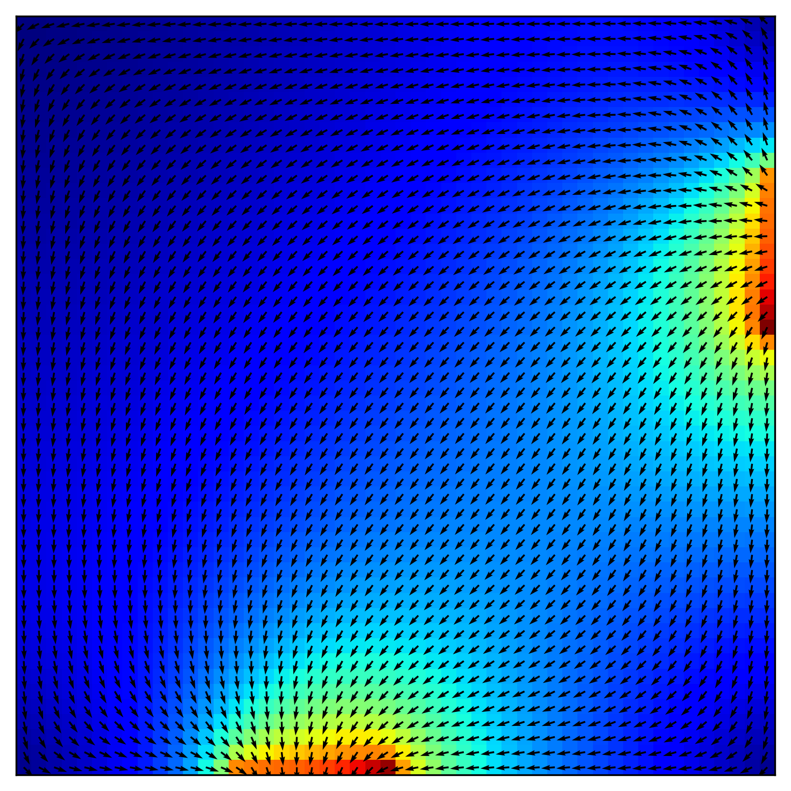
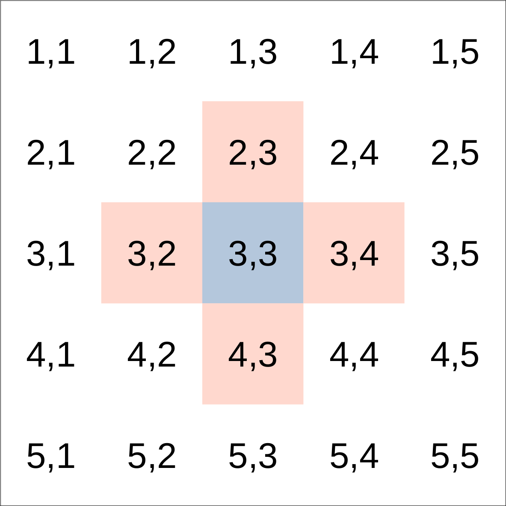

# Problem 4

You have been approached by a researcher who needs some help preparing a computational teaching exercise for an undergraduate module introducing Fluid Dynamics.

Your colleague wants to demonstrate a number of principles, including finite difference approaches and grid decomposition.

They would like a coding exercise to determine the flow pattern of a fluid in a cavity. For simplicity, the liquid is assumed to have zero viscosity which implies that there can be no vortices (i.e. no whirlpools) in the flow. The cavity is a square box with an inlet on one side and an outlet on another as shown below.

  

Describe how you would go about creating a programming exercise to solve this problem, the design decisions and assumptions that you need to let the undergraduates know about, and how you would test a solution. They may also need some pointers and reminders of the underpinning theory.

Provide a commented solution (in a language of your choice).

**Please provide both your code and your explanations in the response to this problem.**

## Solution

In the [cavity_flow](cavity_flow.ipynb) notebook you can find a simple solution for this problem. Please be aware that the algorithm in this notebook is written simply for comprehension purposes. The implemented code returns the following result:

  

## Background

The flow pattern of a fluid can be obtained through velocity vectors at every point in space. However, the representation in terms of several vectors is complicated. An alternative is to use streamlines to represent the flow, where the streamline is a tangential curve to the velocity vector of the flow.

For a two-dimensional inviscid and incompressible flow in the given S region, the stream function satisfies:

  

There are different approaches to find the stream function that satisfies the above equation. For instance, the stream function is going to be calculated using a finite difference approach. In this approach the simulation box is divided in a grid with *m* rows and *n* columns and the stream function is determined for each grid point by averaging the stream function value of the nearest neighbours. For example, a square lattice grid with 5 rows and 5 lines is represented bellow (in red are highlighted the nearest neighbours for the blue grid):

  

Therefore, the stream function value in the grid 3,3 is:

  

Generalising, the value for the stream function in each grid (*i,j*) can be calculated by

  

